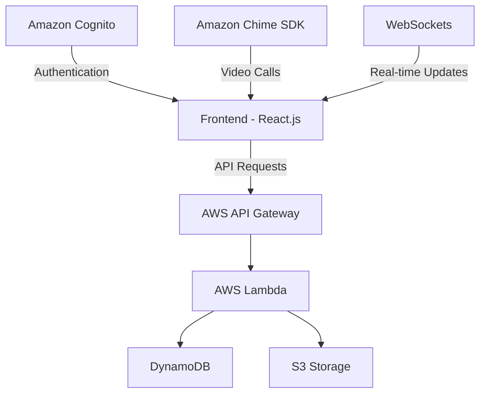

# 🏥 MedConnect Cloud

> A secure, cloud-based telemedicine platform connecting remote patients with healthcare providers.

[](https://choosealicense.com/licenses/mit/)
[](https://aws.amazon.com/)
[](https://reactjs.org/)
[](https://nodejs.org/)

## 📋 Overview

MedConnect Cloud revolutionizes healthcare delivery by enabling virtual consultations and secure medical data management through AWS infrastructure. Our platform bridges the healthcare gap in remote areas, offering:

- HIPAA-compliant video consultations
- Secure health data management
- Efficient appointment scheduling
- Digital prescription services
- User-friendly interfaces for both patients and healthcare providers

## ⭐ Key Features

### 🎥 Real-Time Video Consultations
- Secure, HIPAA-compliant video calls
- Powered by Amazon Chime SDK/WebRTC
- One-on-one consultation support

### 📊 Health Data Management
- Secure medical record uploads
- Real-time access during consultations
- Comprehensive patient history tracking

### 📅 Appointment Scheduling
- Integrated booking system
- Automated notifications
- Efficient workflow management

### 💊 Digital Prescriptions
- Electronic prescription generation
- Secure sharing system
- Digital record keeping

### 📱 User Dashboards
**Patient Dashboard:**
- Appointment tracking
- Medical record access
- Prescription history

**Doctor Dashboard:**
- Schedule management
- Patient records access
- Consultation history

## 💡 Use Cases

1. **Remote Healthcare Access**
   - Serves rural communities
   - Eliminates geographical barriers
   - Improves healthcare accessibility

2. **Chronic Disease Management**
   - Regular remote check-ups
   - Continuous monitoring
   - Treatment plan adjustments

3. **Emergency Consultations**
   - Quick medical advice
   - Reduces ER visits
   - 24/7 availability

4. **Follow-up Appointments**
   - Virtual check-ins
   - Progress monitoring
   - Treatment adjustments

## 🛠️ Technologies Used

### Backend Infrastructure
- **AWS Lambda** - Serverless computing
- **Amazon DynamoDB** - NoSQL database
- **Amazon Cognito** - Authentication
- **AWS S3** - File storage
- **AWS API Gateway** - API management

### Frontend Development
- **React.js** - User interface
- **Node.js** - Runtime environment
- **WebSockets** - Real-time updates

### Communication
- **Amazon Chime SDK/WebRTC** - Video calls
- **WebSockets** - Real-time notifications

## 🏗️ System Architecture



## 🚀 Installation

### Prerequisites

- Node.js (v14+)
- AWS Account
- AWS CLI
- AWS SAM CLI
- React.js development environment

### Step-by-Step Setup

1. **Clone Repository**
   ```bash
   git clone https://github.com/your-repository/medconnect-cloud.git
   cd medconnect-cloud
   ```

2. **Install Dependencies**
   ```bash
   # Backend setup
   cd backend
   npm install

   # Frontend setup
   cd frontend
   npm install
   ```

3. **Configure AWS**
   ```bash
   aws configure
   ```

4. **Deploy Backend**
   ```bash
   sam build
   sam deploy
   ```

5. **Run Frontend**
   ```bash
   cd frontend
   npm start
   ```
   Visit `http://localhost:3000` to access the application.

## 👥 Contributing

We welcome contributions! Here's how you can help:

1. Fork the repository
2. Create your feature branch (`git checkout -b feature/AmazingFeature`)
3. Commit your changes (`git commit -m 'Add some AmazingFeature'`)
4. Push to the branch (`git push origin feature/AmazingFeature`)
5. Open a Pull Request

## 📄 License

This project is licensed under the MIT License - see the [LICENSE](LICENSE) file for details.

---

<div align="center">
Made with ❤️ by the MedConnect Cloud Team
</div>
